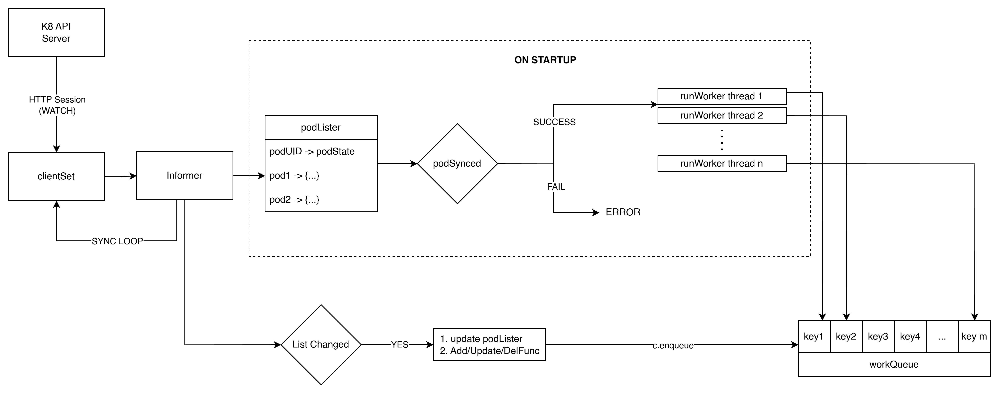
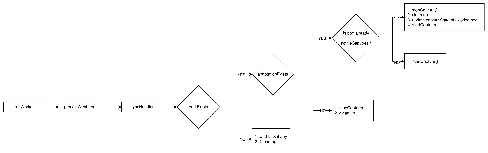

# Antrea Test Task

- **Submitted By:** Sankalp Bansal
- **Github:** [@sankalp-b1401](https://github.com/sankalp-b1401)

I have successfully completed the Antrea test task for LFX Mentorship Q1 while learning the underlying technologies needed to complete this task. I started with understading the high-level architecture of Kubernetes, and worked my way up to understand Antrea's architecture and pod networking concepts and finally completed the task.

---

## Controller Workflow:



## Pod Traffic Capture Workflow:



---

## Controller Features:

- multi-threaded
- node-level filtering so that controller does not try to capture traffic on neighbouring nodes
- annotation sanitization (so invalid entries do not crash the controller)
- UID based pod management (as pod name changes on restarting the pods)
- use of rate-limited Queue for handling work
- handles pod addition, update, and deletion cases separately
- ensures tcpdump process is cleaned up gracefully after pod is deleted/annotation is removed
- uses `nsenter` to inject the `tcpdump` command in the pod

---

## Installation:

**1. Prerequisites**
Before starting, please ensurethe following tools installed:

- Docker
- Kind
- Kubectl
- Helm
- Go

**2. Clone the Repository:**

```
git clone https://github.com/sankalp-b1401/antrea-test-task.git
cd antrea-test-task
```

**3. Deployment:**
The project uses a `Makefile` to automate the cluster creation, image building, and deployment of the controller.

```
make all
```

This command performs the following actions:

- Creates a Kind Cluster: Named antrea-poormans-pcap.
- Installs Antrea CNI: Deploys the Antrea networking layer using Helm.
- Builds & Loads Image: Builds the pcap-controller:latest Docker image and loads it into the Kind nodes.
- Deploys Manifests: Applies the RBAC and DaemonSet configurations from the /manifests directory.
- Sets up Test Environment: Creates a test namespace and deploys a test-pod for verification.

**4. Verify the Installation:**

```
kubectl get pods -n kube-system -l app=pcap-controller
kubectl get pods -n test
```

**5. Capture & Record Results**

```
kubectl annotate pod test-pod -n test "tcpdump.antrea.io=10"
NODE=$(kubectl get pod test-pod -n test -o jsonpath='{.spec.nodeName}')
CPOD=$(kubectl get pods -n kube-system -l app=pcap-controller --field-selector spec.nodeName=$NODE -o jsonpath='{.items[0].metadata.name}')
```

Wait for **5-10** seconds before running:

```
kubectl exec -n kube-system $CPOD -- ls -lh /captures
```

**6. Cleanup:**

```
sudo make cluster-down
```

---

## What I learnt?

I learnt about:

- Kubernetes and how it solves the scalability issues by working along with Docker.
- how Docker's resources are managed by WSL on windows and how this overcomes the docker's limitations of requiring a native Linux kernel to run Linux containers on a Windows host.
- how to configure a linux kernel while trying to setup Antrea on windows as Antrea Deployment on windows using kind is not stable.
- how to use kind, helm and kubectl.
- Antrea's architecture and pod networking concepts.
- control-plane and worker nodes and other related components of nodes and their purpose in Kubernetes.
- difference between Deployment and DaemonSet.
- difference between Edge-triggered and Level-triggered
- how multi-threading is implemented

---

## How I used AI?

I have used AI(Google Gemini 3) for completing the task for the following reasons:

- To understand concepts related to Kind, Kubernetes, and Antrea.
- To review my understaning of the workflow and design of the controller.
- To plan the functionalities of the controller based on my understanding.
- To generate the repository file structure.
- To generate the skeleton code.
- To understand the errors and bugs I came across during the cluster setup.
- To write the Makefile and Dockerfile
